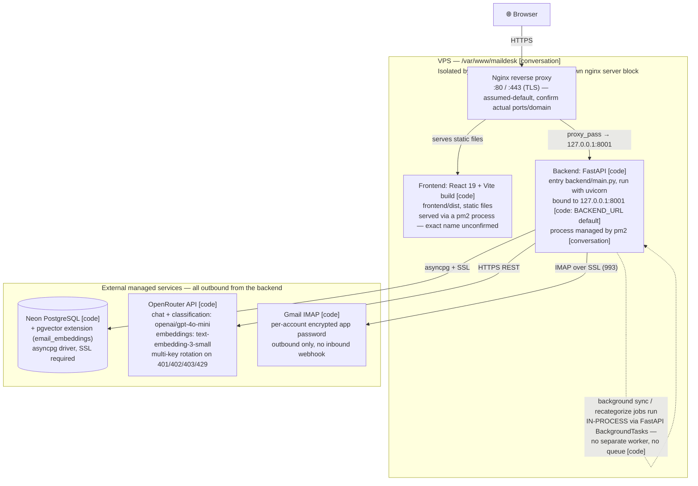

# MailDesk — System Architecture (VPS deployment)

This reflects the self-hosted VPS setup referenced in this project's
deployment conversations (`/var/www/maildesk`, managed with `pm2`), not the
Render/Vercel/Neon path documented in [DEPLOY.md](DEPLOY.md).

**Sourcing key** — every label below is either:
- **[code]** — read directly from this repo (`main.py`, `config.py`,
  `database.py`, `requirements.txt`, `.env.example`, migrations)
- **[conversation]** — stated or implied earlier in this deployment thread
  (e.g. the `/var/www/maildesk` path, `pm2` as the process manager)
- **[assumed-default]** — a standard convention I filled in because it was
  never confirmed (e.g. nginx on 80/443). These are the only values you
  should double-check; everything else is grounded in the repo.

## Notes on things this diagram deliberately does *not* show

- **No Redis / Celery / message queue** — grepped the backend; none exists.
  `background_jobs` is a Postgres table ([jobs/service.py](backend/app/jobs/service.py))
  polled by the frontend every 600ms; the job itself runs as a FastAPI
  `BackgroundTasks` coroutine in the same process as the API.
- **No separate cache service** — the chat answer cache and semantic cache
  live in Postgres tables (`chat_answer_cache`), not an external cache layer.
- **No Docker** — nothing in the repo builds a container image for this app.

## What to correct if wrong

Only these are unconfirmed and worth a one-line correction from you rather
than a diagram edit:
1. Nginx's actual listening ports / domain (assumed 80/443 + TLS)
2. The pm2 process name(s) for frontend and backend
3. Whether nginx terminates TLS itself, or something in front of it
   (Cloudflare, another proxy) does

Everything else — the backend port (8001), Neon+pgvector as the database,
OpenRouter as the only external AI dependency, Gmail IMAP as the only mail
transport, and the absence of any queue/cache service — is read directly
from the code, not inferred.
